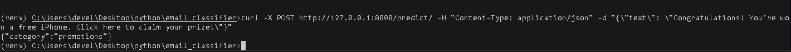

# 📧 AI-Powered Email Classifier

An intelligent email classification system using Machine Learning and Natural Language Processing (NLP). This API can classify emails into categories like **spam**, **personal**, **work**, **promotions**, etc.

---

## 🚀 Features

- 🔍 Pre-trained ML model using Logistic Regression
- 🧠 Text preprocessing with TF-IDF
- ⚡ FastAPI backend with prediction endpoint
- 🧪 Swagger docs for testing API
- 🗂️ Easily extendable with more categories or models

---

## 🏗️ Project Structure

- email_classifier/
  - app/
    - main.py             # FastAPI app for handling API routes
    - model.py            # (Optional) Logic to load and predict using ML model
  - model/
    - email_classifier.pkl  # Trained ML model file (TF-IDF + Logistic Regression)
  - train/
    - train_model.py      # Script to train and save the model
    - dataset.csv         # Email data with text and labels
  - requirements.txt      # Python dependencies
  - README.md             # Project documentation


---

## 🧠 Model

- **Algorithm**: Logistic Regression
- **Vectorizer**: TF-IDF
- **Labels**: `spam`, `personal`, `work`, `promotions`, `updates`, etc.

---

## ⚙️ Installation

1. **Clone the repository:**
   ```bash
   git clone https://github.com/sujit-codezen/ai_email_classifier.git
   cd email_classifier
   ```

2. **Create virtual environment (optional but recommended):**
    ```bash
    python -m venv env
    source env/bin/activate  # On Windows: env\Scripts\activate
    ```

3. **Install dependencies:**
    ```bash
    pip install -r requirements.txt
    ```

4. **Train the Model:**
    ```bash
    cd train
    python train_model.py
    ```

5. **Run the API Server:**
    ```bash
    cd ../app
    uvicorn main:app --reload
    ```

## Output



